# DataRescue architecture

DataRescue is intentionally a small, evidence-gated system rather than a general autonomous-agent framework. One FastAPI process exposes the API and serializes evidence-producing work through a single in-process worker lane. SQLite records every case transition and event. PostgreSQL and dbt provide the real validation plane.

```mermaid
flowchart LR
    MCL[DataHub schemaMetadata MCL] --> Actions[Pinned DataHub Actions consumer]
    Actions --> Intake[Idempotent event intake]
    Intake --> Store[(SQLite event store)]
    Store --> Worker[Recovery worker]
    Worker --> Context[DataHub MCP context reader]
    Context --> Candidates[Structured candidate proposer]
    Candidates --> Sandbox[Isolated PostgreSQL schemas]
    Sandbox --> Dbt[dbt build]
    Dbt --> Policy[Deterministic policy engine]
    Policy -->|pass| GitHub[Draft GitHub PR]
    Policy -->|fail closed| Guard[Circuit breaker]
    GitHub --> Human[Human merge]
    Human --> Verify[Post-deploy verification]
    Verify --> Incident[Resolve DataHub incident]
```



## Trust boundaries

- The language model may propose structured field mappings and evidence references. It cannot approve a repair.
- DataHub context is treated as untrusted input. Retrieved SQL is never executed.
- The backend renders a narrow, allowlisted `SELECT` projection from validated identifiers.
- Every candidate runs in its own PostgreSQL schema.
- Opening a draft PR is not recovery. The incident remains active until the merged revision passes the same gates.
- Missing, stale, or conflicting evidence fails closed.

## State machine

```text
DETECTED → CONTEXT_GATHERED → CANDIDATES_READY → VALIDATING
         → PATCH_READY → PR_OPEN → DEPLOYED
         → POST_DEPLOY_VERIFIED → RESOLVED

Any evidence/policy failure → CONTAINED
Any integration/runtime failure → FAILED
```

The store rejects invalid transitions and retains an append-only event record so the UI can explain every claim.

## DataHub identity

Both ingestion recipes share:

```yaml
env: PROD
convert_urns_to_lowercase: true
```

The Postgres recipe declares `platform_instance: datarescue-demo`, and the dbt source mirrors that identity with `target_platform: postgres`, `target_platform_instance: datarescue-demo`, and `include_database_name: true`. This keeps physical and dbt metadata aligned to the same asset identity.

## Recovery policy

The default policy requires current semantic evidence, a successful dbt build, total variance no greater than 0.50%, row-count variance no greater than 0.10%, PK overlap of at least 99.90%, and null-rate delta no greater than 0.50 percentage points.

## Integration modes

- **Replay:** deterministic case and artifacts; no external credentials; suitable for the hosted UI and fast judging.
- **Local live (`make demo`):** recorded DataHub context with real PostgreSQL/dbt candidate execution. External operations remain explicitly labeled.
- **Connected (`make demo-connected`):** real DataHub MCL/MCP/GraphQL, OpenAI proposals, PostgreSQL/dbt execution, and GitHub draft PR. Required endpoints and credentials fail fast; the launcher forces `replay=false` and `execution=postgres`.

The connected launcher never infers Kafka topology. It uses the explicit host
ports published by the pinned DataHub v1.6 Quickstart or caller-provided
`DATAHUB_KAFKA_BOOTSTRAP` and `DATAHUB_SCHEMA_REGISTRY_URL` values. The API must
report healthy PostgreSQL mode before the Actions process starts, and schema
drift is not applied until Kafka reports an assigned member in the Actions MCL
consumer group.
