# DataRescue architecture

DataRescue is intentionally a small, evidence-gated system rather than a general autonomous-agent framework. One FastAPI process exposes the API and serializes evidence-producing work through a single in-process worker lane. SQLite records every case transition and event. PostgreSQL and dbt provide the real validation plane.

```mermaid
flowchart LR
    MCL[DataHub schemaMetadata MCL] --> Actions[Pinned DataHub Actions consumer]
    Actions --> Intake[Idempotent event intake]
    Intake --> Store[(SQLite event store)]
    Store --> Worker[Recovery worker]
    Worker --> Context[DataHub MCP context reader]
    Context --> Candidates[Structured candidate proposer]
    Candidates --> Sandbox[Isolated PostgreSQL schemas]
    Sandbox --> Dbt[dbt build]
    Dbt --> Policy[Deterministic policy engine]
    Policy -->|pass| GitHub[Draft GitHub PR]
    Policy -->|fail closed| Guard[Circuit breaker]
    GitHub --> Human[Human merge]
    Human --> Verify[Post-deploy verification]
    Verify --> Incident[Resolve DataHub incident]
```



## Trust boundaries

- The language model may propose structured field mappings and evidence references. It cannot approve a repair.
- DataHub context is treated as untrusted input. Retrieved SQL is never executed.
- The backend renders a narrow, allowlisted `SELECT` projection from validated identifiers.
- Every candidate runs in its own PostgreSQL schema.
- Opening a draft PR is not recovery. The incident remains active until the merged revision passes the same gates.
- Missing, stale, or conflicting evidence fails closed.

## State machine

```text
DETECTED → CONTEXT_GATHERED → CANDIDATES_READY → VALIDATING
         → PATCH_READY → PR_OPEN → DEPLOYED
         → POST_DEPLOY_VERIFIED → RESOLVED

Any evidence/policy failure → CONTAINED
Any integration/runtime failure → FAILED
```

The store rejects invalid transitions and retains an append-only event record so the UI can explain every claim.

## DataHub identity

Both ingestion recipes share:

```yaml
env: PROD
convert_urns_to_lowercase: true
```

Both recipes intentionally leave platform instance unset. The dbt source uses
`target_platform: postgres` and `include_database_name: true`, producing the
same canonical physical URN as PostgreSQL ingestion:

```text
urn:li:dataset:(urn:li:dataPlatform:postgres,datarescue.raw.payments_raw,PROD)
```

The connected bootstrap verifies four semantic edges before MCP context is
trusted: physical source → dbt source, dbt source → dbt staging, dbt staging →
materialized PostgreSQL staging, and materialized staging → dbt mart. DataHub's
native dbt ingestion also emits a physical source → materialized staging edge;
that single parallel edge is explicitly allowlisted. Other shortcuts, missing
edges, or a flattened star topology fail the contract.

## Recovery policy

The default policy requires current semantic evidence, a successful dbt build, total variance no greater than 0.50%, row-count variance no greater than 0.10%, PK overlap of at least 99.90%, and null-rate delta no greater than 0.50 percentage points.

## Integration modes

- **Replay:** deterministic case and artifacts; no external credentials; suitable for the hosted UI and fast judging.
- **Local live (`make demo`):** recorded DataHub context with real PostgreSQL/dbt candidate execution. External operations remain explicitly labeled.
- **Connected (`make demo-connected`):** real DataHub MCL/MCP/GraphQL, OpenAI proposals, PostgreSQL/dbt execution, and GitHub draft PR. Required endpoints and credentials fail fast; the launcher forces `replay=false` and `execution=postgres`.

After drift ingestion, the connected launcher runs a bounded proof over exactly
one current case. It succeeds only when the live MCL path reaches `PR_OPEN`, the
wrong gross candidate is rejected, the net candidate is selected from real dbt
evidence, evidence write-back is verified, and the remote incident remains
`ACTIVE`. This boundary deliberately excludes human merge, deployment, and
exact-commit post-deploy resolution.

The connected launcher owns a pinned official DataHub MCP v0.6 HTTP process on
loopback unless an explicit external HTTPS endpoint is supplied. External MCP
authentication uses a separate token; the DataHub GMS credential is never
forwarded. Its composite context read uses `get_entities`, `list_schema_fields`,
and directed `get_lineage` calls; evidence write-back uses mutation-gated
`save_document` followed by an exact GMS `documentInfo` read-back. This direct
read verifies the persisted title, content, and related asset without relying
on a capped related-document page returned for the asset. Incident mutations
are held to the same standard: raise and resolve are successful only after GMS
`incidentInfo` reports the expected remote `ACTIVE` or `RESOLVED` state and
identity. The canonical asset is accepted only when the verified owner,
deterministic context document, complete schema, and required directed lineage
topology are present in the live responses.

The connected launcher never infers Kafka topology. It uses the explicit host
Kafka port and the internal Schema Registry proxy exposed through the pinned
DataHub v1.6 GMS, or caller-provided `DATAHUB_KAFKA_BOOTSTRAP` and
`DATAHUB_SCHEMA_REGISTRY_URL` values. The API must
report healthy PostgreSQL mode before the Actions process starts, and schema
drift is not applied until Kafka reports an assigned member in the Actions MCL
consumer group.

Launcher health is also process-owned evidence: the configured loopback port
must be free before startup, and the spawned API must echo a per-run nonce plus
a digest of the intended state-database path before it is trusted. Candidate dbt
builds use private target directories, and reconciliation reads the exact
`<candidate_schema>.fct_revenue` relation that dbt built. A zero dbt exit code is
not evidence on its own: missing or malformed `run_results.json`, the wrong
invocation type, absent expected models/tests, or any non-success node fails
closed. DataHub artifacts are built into a unique complete snapshot, held
unchanged and mounted read-only for the lifetime of the ingestion consumer, so
another build cannot substitute its run result, manifest, or catalog.
